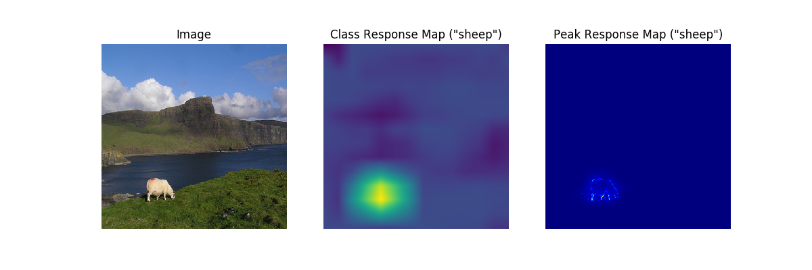
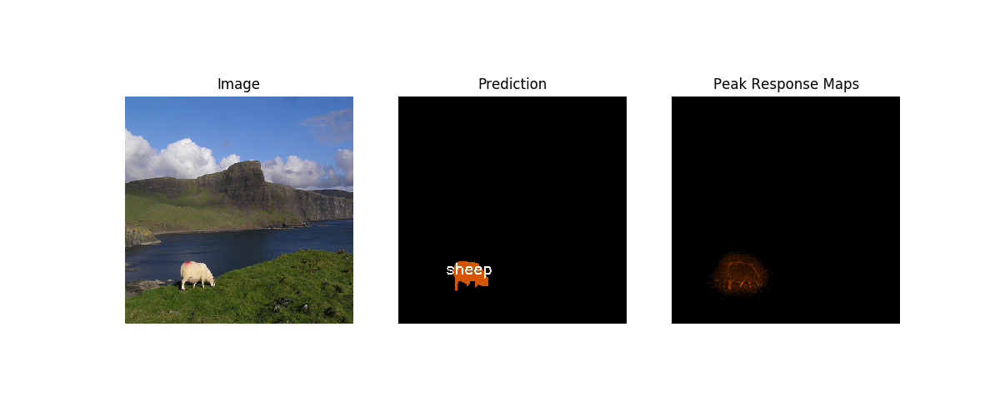

# The reconstruction implementation of [PRM](https://github.com/ZhouYanzhao/PRM) by removing third-party dependency(i.e, [Nest](https://github.com/ZhouYanzhao/Nest)).
## Motivation: An ultra-thin version of PRM, which aims at improving readability and expansibility. 
### Rule No.1: Never make code too complicated. :joy:


#### Version info: pytorch 0.4.1, python 3.6

## Training & Inference
Training:
```pythobn
python main.py --train True
```

Inference:
```pythobn
python main.py 
```

## Sample result

<figure class="half">
    
</figure>
<figure class="half">
    
</figure>


### Reference
```markdown
@INPROCEEDINGS{Zhou2018PRM,
    author = {Zhou, Yanzhao and Zhu, Yi and Ye, Qixiang and Qiu, Qiang and Jiao, Jianbin},
    title = {Weakly Supervised Instance Segmentation using Class Peak Response},
    booktitle = {CVPR},
    year = {2018}
}
```